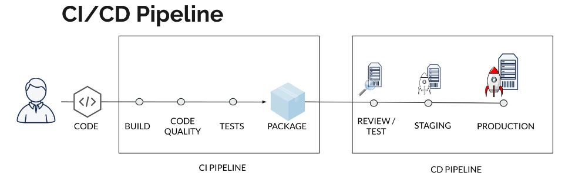
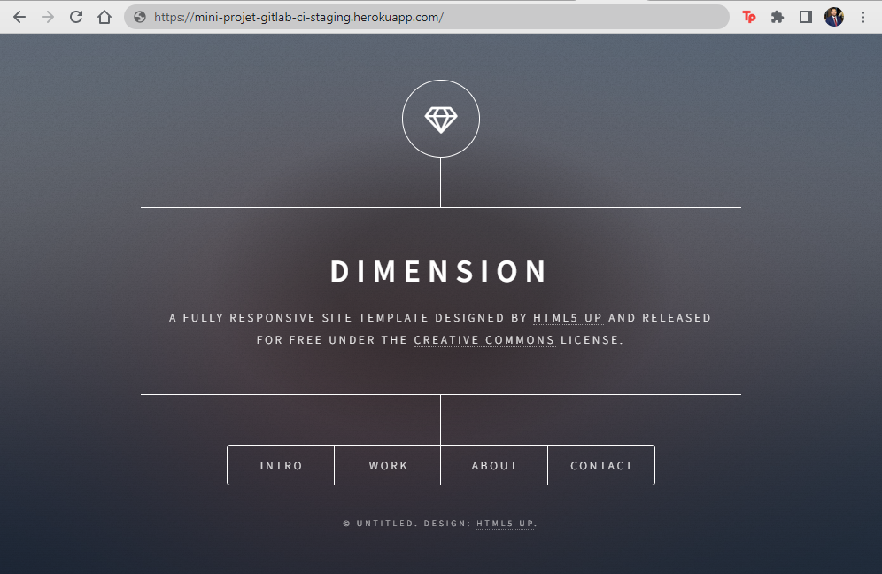

# Mini-projet GitLab CI

Dans ce projet, j'ai conteneurisé une application web statique existante et mis en place un pipeline de CI/CD sur GitLab pour automatiser les étapes de construction, de test et de déploiement de l'application sur Heroku. Ce rapport explique les étapes du pipeline que vous trouverez dans le fichier `.gitlab-ci.yml`, et les avantages de cette approche.

---

Auteur : Abdel-had HANAMI

Contexte : formation Bootcamp DevOps promotion 12

Centre de formation : eazytraining.fr

Période : mars-avril-mai

Date : 15 avril 2023

LinkedIn : https://www.linkedin.com/in/abdel-had-hanami/

## Aperçu du pipeline CI/CD

## Workflow du Pipeline CI/CD avec Conditions d'Exécution

1. **Build image**
   - *Condition* : S'exécute pour chaque commit.
   - Construit l'image Docker en utilisant le Dockerfile que j'ai créé.
   - Utilise une approche multi-stage pour réduire la taille de l'image finale et améliorer les temps de construction.
   
2. **Acceptance test**
   - *Condition* : S'exécute pour chaque commit.
   - Exécute des tests d'acceptation sur l'image Docker construite.
   - Charge l'image à partir de l'artefact `static-website.img.tar`, puis exécute le conteneur.
   - Teste le service en effectuant une requête HTTP et en vérifiant la présence d'un contenu spécifique dans la réponse.

3. **Release image**
   - *Condition* : S'exécute pour chaque commit.
   - Publie l'image Docker dans le registre de GitLab.
   - Charge l'image à partir de l'artefact `static-website.img.tar`, puis la tag avec le nom de la branche et le commit SHA.
   - Pousse l'image dans le registre de GitLab pour garder une trace des images pour chaque commit et branche.

4. **Deploy review**
   - *Condition* : S'exécute pour chaque nouvelle merge request ou mise à jour d'une merge request existante.
   - Déploie l'application dans un environnement de révision sur Heroku (pour les merge requests).
   
5. **Stop review**
   - *Condition* : S'exécute lorsqu'une merge request est fermée ou acceptée.
   - Arrête l'environnement de révision sur Heroku pour libérer des ressources et garder les environnements de déploiement propres.

6. **Deploy staging**
   - *Condition* : S'exécute lorsqu'un commit est poussé sur la branche `main` ou `master`.
   - Déploie l'application dans un environnement de préproduction (staging) sur Heroku.
   
7. **Test staging**
   - *Condition* : S'exécute après le déploiement réussi dans l'environnement de préproduction.
   - Exécute des tests sur l'environnement de préproduction pour s'assurer que l'application fonctionne correctement.
   
8. **Deploy prod**
   - *Condition* : S'exécute manuellement après validation des tests de préproduction.
   - Déploie l'application dans l'environnement de production sur Heroku.
   
9. **Test prod**
   - *Condition* : S'exécute après le déploiement réussi dans l'environnement de production.
   - Exécute des tests sur l'environnement de production pour garantir le bon fonctionnement de l'application.

## Explications détaillées du pipeline

### Build image

J'ai créé un Dockerfile pour construire une image Docker contenant l'application web statique et le serveur HTTP. J'ai utilisé une approche multi-stage pour réduire la taille de l'image finale et améliorer les temps de construction. Les avantages de cette approche incluent une séparation claire des préoccupations (clonage du dépôt, copie du code source) et une réduction de la taille de l'image finale en n'incluant que les fichiers nécessaires.

### Acceptance test
 
Dans cette étape, des tests d'acceptation sont exécutés sur l'image Docker construite. L'image est chargée à partir de l'artefact `static-website.img.tar`, puis exécutée en tant que conteneur. Le service est testé en effectuant une requête HTTP et en vérifiant la présence d'un contenu spécifique ("Dimension") dans la réponse.

### Release image

Ici, l'image Docker est publiée dans le registre de GitLab. L'image est d'abord chargée à partir de l'artefact `static-website.img.tar`, puis taguée avec le nom de la branche et le commit SHA. Ensuite, elle est poussée dans le registre. Ceci permet de garder une trace des images pour chaque commit et branche, facilitant le suivi des versions et la gestion des déploiements.

### Deploy review, staging, et prod

J'ai mis en place des étapes de déploiement pour différents environnements (review, staging et production) sur Heroku. Ces étapes permettent d'assurer que l'application est correctement testée et vérifiée avant d'être déployée en production. Les étapes de déploiement utilisent des variables d'environnement pour différencier les environnements et s'assurer que les bonnes configurations sont appliquées.

### Stop review

L'étape "Stop review" est conçue pour arrêter et supprimer l'environnement de révision sur Heroku lorsqu'il n'est plus nécessaire. Cela permet de libérer des ressources et de garder les environnements de déploiement propres.

### Test staging et Test prod

Après chaque déploiement dans les environnements staging et production, j'ai ajouté des étapes pour tester l'application déployée. Cela garantit que l'application fonctionne correctement dans l'environnement cible avant d'être considérée comme prête pour une utilisation en production.

## Aperçu du site

## Technologies utilisées

- Docker : Pour conteneuriser l'application et faciliter son déploiement.
- GitLab CI/CD : Pour automatiser les étapes de construction, de test et de déploiement de l'application.
- Heroku : Pour héberger l'application dans différents environnements (review, staging et production).

## Conclusion

En mettant en place ce pipeline CI/CD pour l'application web statique, j'ai pu automatiser les processus de construction, de test et de déploiement, tout en garantissant que l'application est correctement testée et fonctionnelle avant d'être mise en production. L'utilisation de Docker et de GitLab CI/CD a facilité la gestion des environnements et des déploiements, offrant un moyen efficace et fiable de mettre à jour et de maintenir l'application.
